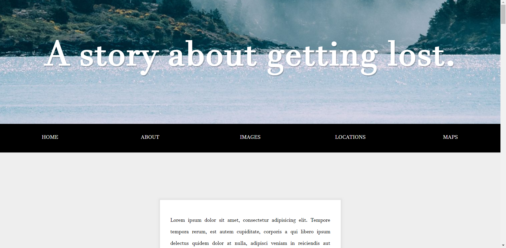
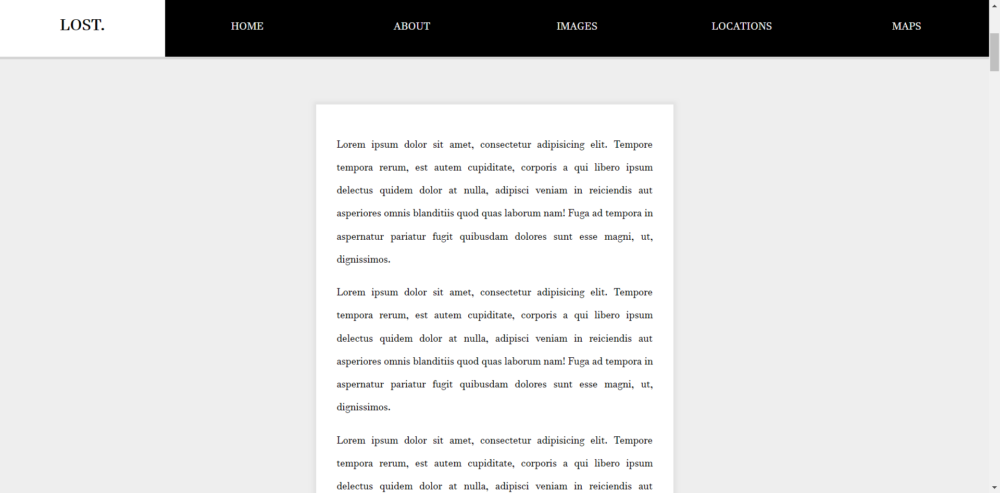

# Practice with Fixed Navigation List

This exercise demonstrates what a blog post would look like with a navigation menu bar that sticks to the top of the page as the user scrolls farther down to read the post, while animating an additional title tab once the scrolling has taken place.

What I took away from this project was how simple it is to create a visually appealing effect with an otherwise standard webpage feature, merely by adding/removing a CSS class after adjusting the navigation bar to account for the leftover space once the fixed state is set.

## Before scrolling:

## After scrolling:

### Credits

This project was created with help from Wes Bos, whose website can be found [here](https://wesbos.com/).